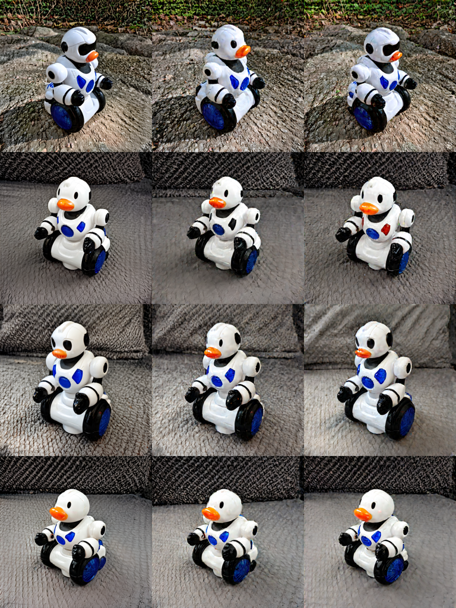

# Orth_MC_Dropout

This is the official GitHub repository for the paper **"Rethinking Inter-LoRA Orthogonality in Adapter Merging: Insights from Orthogonal Monte Carlo Dropout."** [arXiv](https://arxiv.org/abs/2510.03262)

## Quick Start

Run the following command directly:

```bash
bash run.sh
```

After execution:

* Generated images will be saved in `./output`
* Concatenated preview images will be available in `./concat_img`

## Adding a New Case

1. Add a configuration file in `.toml` format to the `./configs` folder.
2. Add the case name to the `CASE_NAMES` list in `run.sh`.
3. Make sure the `save_folder_name` property inside the `.toml` file matches the filename (excluding the extension).

You can refer to the sample configs provided in this repository for guidance.

## Showcase

Below are some comparison results from the paper:




---

This project is licensed under the MIT License. See the [LICENSE](LICENSE) file for details.

